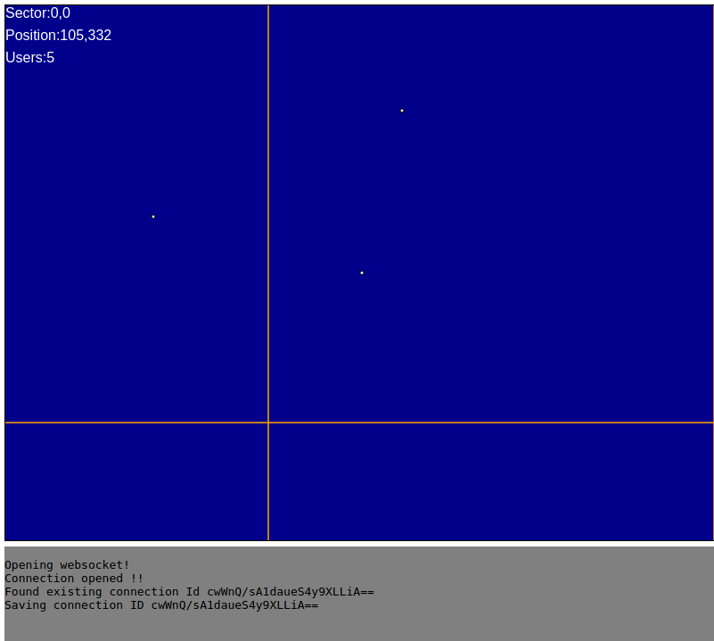

# Work in progress

## Description

Proceduraly generated RPG multiplager game with websockets



## Run

```
npm install
node server.js
```

Run `client.hmtl` on your browser to start sending requests to `localhost:8001`.

See `websocket.js` for client details.
